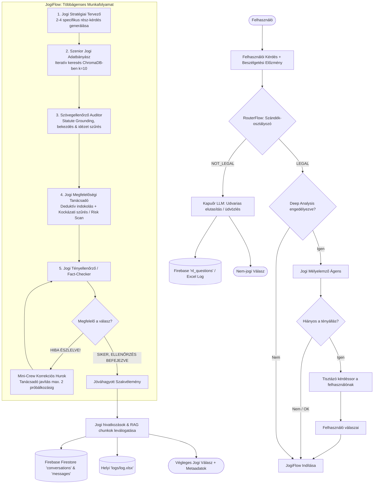

# ⚖️ JogiAgent Crew – Multi-Agent RAG Architektúra Magyar Jogi Dokumentumokhoz

[](https://www.python.org/)
[](https://crewai.com)
[](https://langchain.com)
[](https://fastapi.tiangolo.com/)
[](https://www.trychroma.com/)
[](https://confident-ai.com/)
[](https://firebase.google.com/)

Ez a projekt egy autonóm, többágenses döntési és végrehajtási folyamatra épülő, nagydimenziós szemantikus kereső és jogi dokumentumelemző **RAG (Retrieval-Augmented Generation)** rendszer. A fejlesztés elsődleges célja komplex, strukturálatlan magyar és európai uniós jogi forrásszövegek feldolgozása, paragrafus-szintű indexelése, valamint a jogi kontextushoz szigorúan illeszkedő, hallucinációmentes válaszok generálása.

A rendszer konzolos interaktív felületen (CLI) és éles környezetbe illeszthető, biztonságos **FastAPI REST API** mikroszolgáltatásként is üzemeltethető.

### Támogatott jogforrások
*   **Polgári Törvénykönyv (Ptk.)** (`2013_V_PTK.pdf`)
*   **Személyi Jövedelemadó törvény (SZJA)** (`1995_CXVII_SZJA_TVK.pdf`)
*   **GDPR szabályozás (Általános Adatvédelmi Rendelet)** (`GDPR_2016.pdf`)
*   **Munka Törvénykönyve (Mt.)** (`edutax_mt2026_web.pdf`)

---

## 🏗️ Rendszerarchitektúra és Munkafolyamat

A rendszer többrétegű vezérlési architektúrát alkalmaz: az intelligens kérés-irányítástól (`RouterFlow`) az opcionális tényállás-tisztázáson (`Deep Analysis`) át a többágenses RAG kutató és auditáló munkafolyamatig (`JogiFlow`).



---

## 🧩 Főbb Komponensek és Szerepkörök

### 1. Intelligens Kérés-Irányító Kapuőr (`RouterFlow` – `src/jogi_agent/router.py`)
A rendszer legelső védelmi vonala. Mielőtt bármilyen erőforrás-igényes RAG keresés lefutna, a Router bináris osztályozást végez a korábbi beszélgetési kontextus figyelembevételével:
*   **`LEGAL`**: A kérdés jogi jellegű, jogszabályokhoz, munkaviszonyhoz, szerződésekhez vagy hatósági ügyekhez kapcsolódik. Továbbítja a vezérlést a `JogiFlow`-nak.
*   **`NOT_LEGAL`**: Csevegés, üdvözlés, elköszönés, recepteket/időjárást firtató vagy értelmetlen kérdések esetén azonnal professzionális, határozott választ ad. Rögzíti az eseményt a Firebase `nl_questions` gyűjteményébe anélkül, hogy a RAG motort terhelné.

### 2. Jogi Mélyelemző Modul (`Deep Analysis` – `src/jogi_agent/utils.py`)
Összetett jogi élethelyzeteknél a felhasználók gyakran kihagynak kritikus körülményeket (pl. szerződés pontos típusa, munkaviszony vagy megbízás jellege, felmondás indoka).
*   **Vezérlés és futtatás**: A folyamat vezérlését a `src/jogi_agent/utils.py` modulban található `init_deep_analysis()` és `run_deep_analysis()` függvények valósítják meg.
    *   A szerepköri leírásokat és promptokat a `config/deep_analyst_agent.yaml` és `config/deep_analysis_task.yaml` konfigurációs fájlok tárolják, amelyekből a segédfüggvény dinamikusan felépíti a CrewAI `Agent` és `Task` példányokat.
    *   **CLI felületen**: A `src/jogi_agent/main.py` `run()` ciklusa felügyeli a folyamatot. Ha a `config.ini`-ben a `deep_analysis_enabled = True`, akkor a fő RAG folyamat előtt lefut a mélyelemző, kiírja a célzott tisztázó kérdéseket a konzolra, bekéri a felhasználó kiegészítő válaszait (`da_answers`), majd ezeket struktúráltan továbbadja a `RouterFlow` és a `JogiFlow` stratégiai tervezőjének.
    *   **REST API felületen**: A `src/api/api_main.py` `/api/v1/askDeepAnalysis` végpontja hívja meg ugyanezt a vezérlő logikát, lehetővé téve a frontend alkalmazások számára a kétlépcsős, interaktív tényállás-tisztázást.
*   **Aktiválás**: A `src/jogi_agent/config/config.ini` fájlban a `deep_analysis_enabled` logikai kapcsolóval engedélyezhető vagy tiltható le.

### 3. Többágenses Jogi Végrehajtó Rendszer (`JogiFlow` & `JogiAgent`)
A tényleges elemzést egy szigorúan koordinált ágenscsapat végzi:
1.  **Jogi Stratégiai Tervező (`jogi_strategist`)**: Strukturálja a kérdést, és 2–4 egymástól független, RAG-keresésre optimalizált rész-kérdésre bontja a releváns jogterületek szerint (Ptk., GDPR, Mt., SZJA).
2.  **Szenior Jogi Adatbányász (`jogi_researcher`)**: Minden rész-kérdésre iteratív módon külön-külön lefuttatja a RAG eszközt (`custom_tool.py`), és nyers, strukturált JSON formátumba rendezi a találatokat.
3.  **Jogszabályi Megalapozottsági Auditor (`jogi_grounding_verifier`)**: Végrehajtja a *Statute Grounding* folyamatot: azonosítja a konkrét bekezdéseket, pontokat, kiszűri a szöveges zajt, és összeállítja a hitelesített szó szerinti idézeteket.
4.  **Vezető Jogi Megfelelőségi Tanácsadó (`jogi_advisor`)**: Deduktív logikával kidolgozza a hivatalos szakvéleményt, lefolytatja a **Kockázati Szűrést (Risk Scan)** az abszolút kijelentések ellenőrzésére és a jogi kivételek feltárására.
5.  **Jogi Tényellenőrző (`jogi_fact_checker`)**: Mikroszintű összevetést végez a megfogalmazott szakvélemény és a kinyert RAG törvényszövegek között. Hallucináció vagy rossz paragrafusszám esetén `HIBA ÉSZLELVE!` jelzéssel azonnal aktiválja a **korrekciós hurkot (Correction Loop)**, amely legfeljebb 2 alkalommal automatikusan újrageneráltatja a választ.

### 4. Jogi Szövegekre Hangolt RAG Pipeline (`src/rag.py` & `src/jogi_agent/tools/custom_tool.py`)
A hagyományos, karakterszám-alapú darabolás szétvágja a jogi normákat. Emiatt a rendszer egyedi szabályrendszert használ:
*   **Strukturális Regex Chunking**: A dokumentumok feldolgozása a jogszabályi hierarchia határain történik (pl. `\d+\.\s*§`, `\d+:\d+\.\s*§` vagy `\d+\.\s*[Cc]ikk`), így egy chunk pontosan egy jogi egységet alkot.
*   **Biztonsági Méretkorlát**: A 1500 karakternél hosszabb bekezdések vágásra kerülnek az LLM kontextus-stabilitásának megőrzése érdekében.
*   **Vektoradatbázis és Hasonlóság**: Helyi ChromaDB tárolás koszinusz-távolsággal és Google `gemini-embedding-001` beágyazásokkal.

### 5. Kettős Naplózás és Felhő Integráció
*   **Lokális Analitika (`logs/log.xlsx`)**: Minden kérdéshez elmenti a kérdésazonosítót, a választ, a RAG chunkokat, a futásidőt, a felhasznált tokeneket (összes, prompt, kiegészítés), valamint az egyes ágensek részeredményeit.
*   **Firebase Firestore**: Felhő alapú szinkronizáció a webes frontendek kiszolgálására (`conversations`, `messages`, `comments`, `nl_questions` kollekciók).

---

## 📊 Modell-összehasonlítás és Teszteredmények

A rendszer pontosságát, megbízhatóságát és hatékonyságát a **DeepEval** keretrendszerrel mértük fel, független bíráló LLM (Azure OpenAI `gpt-5-mini`) segítségével.

> [!IMPORTANT]
> **A tesztek reprezentatív mintán, 25 azonos kérdésen futottak le az alábbi összetételben:**
> *   Jogforrásonként (Mt., GDPR, Ptk., SZJA) **3 könnyű / alapvető** kérdés (összesen 12 db),
> *   Jogforrásonként **2 nehéz, speciális kivételekre fókuszáló** kérdés (összesen 8 db),
> *   **5 darab komplex, kombinált kérdés**, amelyek párhuzamosan több jogterület (pl. Munkajog ÉS Adatvédelem) összehangolt vizsgálatát igénylik.

A vizsgálat során 6 különböző architektúrális felépítést hasonlítottunk össze:

| Metrika | Base Model (5 ágens Verifier-rel) | Base Model (Verifier nélkül) | Unified Model (Researcher + Grounding) Verifier-rel | Unified Model (2-3) Verifier nélkül | Unified Model 1-3 Verifier nélkül | Unified Model 2-4 Verifier nélkül *(Aktív beállítás)* |
| :--- | :---: | :---: | :---: | :---: | :---: | :---: |
| **Faithfulness (Tényhűség)** | 0.9720 (97.2%) | 0.9853 (98.5%) | 0.9860 (98.6%) | **0.9910 (99.1%)** | 0.9896 (99.0%) | 0.9822 (98.2%) |
| **Hallucinációs Arány** | 2.80% | 1.47% | 1.40% | **0.90%** | 1.04% | 1.78% |
| **Answer Relevancy (Válasz-relevancia)** | 0.9872 (98.7%) | 0.9623 (96.2%) | 0.9814 (98.1%) | 0.9806 (98.1%) | **0.9874 (98.7%)** | 0.9624 (96.2%) |
| **Context Relevancy (Kontextus-relevancia)**| 0.9667 (96.7%) | 0.9087 (90.9%) | 0.8847 (88.5%) | **0.9733 (97.3%)** | 0.9200 (92.0%) | 0.9127 (91.3%) |
| **Átlagos Tokenfogyasztás** | 16 870 token | **10 250 token** | 16 484 token | 10 966 token | 12 224 token | 12 087 token |
| **Átlagos Futási Idő (Runtime)** | 23.34 s | 18.27 s | 20.14 s | 16.37 s | 19.13 s | **16.32 s** |
| **Verifier lefutások száma (25 kérdés alatt)**| 6 alkalom | – | 3 alkalom | – | – | – |

### 📈 Főbb Következtetések és Tanulságok
1.  **Ablation eredmények**: A kutató és a szövegellenőrző ágens összevonása (`Unified Model 2-3 without Verifier`) érte el a legmagasabb tényhűséget (**99.1%**) és a legalacsonyabb hallucinációs arányt (**0.9%**), miközben a válaszidő **30%-kal csökkent** a bázismodellhez képest.
2.  **A Verifier szerepe és költsége**: A dedikált Verifier ágens hasznos a tárgyi tévedések kiszűrésére, azonban a visszacsatolási hurok miatt jelentősen megnöveli a tokenfelhasználást (~16.8k token) és a válaszidőt (23.3s). 
3.  **Aktív architektúra**: A jelenleg élesített összevont konfiguráció (`Unified Model 2-4`) a leggyorsabb átlagos futásidőt (**16.32 mp**) és alacsony tokenfogyasztást nyújt kiegyensúlyozott, 98.2%-os jogi pontosság mellett.

---

## 📂 Projektstruktúra

```
jogi-agent-rag/
├── chroma_db/                          # Helyi vektoros adatbázis (indexelt jogszabályok)
├── logs/                               # Rendszernaplók könyvtára
│   ├── generate_log.py                 # Új üres log.xlsx létrehozása
│   └── log.xlsx                        # Részletes futási analitika és telemetria
├── pdf/                                # Bemeneti PDF forrásdokumentumok (Ptk, Mt, GDPR, SZJA)
├── src/                                # Alkalmazás forráskódja
│   ├── api/                            # REST API mikroszolgáltatás
│   │   ├── api_main.py                 # FastAPI alkalmazás, hitelesítés és végpontok
│   │   └── report.md                   # Generált kimeneti sablon
│   ├── jogi_agent/                     # CrewAI ágensek és folyamatvezérlés
│   │   ├── config/                     # YAML és INI konfigurációs állományok
│   │   │   ├── agents.yaml             # Aktív ágens szerepkörök és promptok
│   │   │   ├── agents_compare.yaml     # Kísérleti és összevont ágens-konfigurációk
│   │   │   ├── config.ini              # Rendszerszintű beállítások (Verbose, Deep Analysis)
│   │   │   ├── deep_analyst_agent.yaml # Mélyelemző ágens definíciója
│   │   │   ├── deep_analysis_task.yaml # Mélyelemző feladat leírása
│   │   │   └── tasks.yaml              # Jogi feladatok leírása és várt kimenetei
│   │   ├── tools/                      # Ágensek által használt egyedi eszközök
│   │   │   ├── __init__.py
│   │   │   └── custom_tool.py          # RAG keresőeszköz a ChromaDB lekérdezéséhez
│   │   ├── __init__.py
│   │   ├── crew.py                     # CrewAI ágensek és feladatok deklarációja
│   │   ├── flow.py                     # JogiFlow (korrekciós hurok és állapotkezelés)
│   │   ├── main.py                     # CLI belépési pont és teszt futtató
│   │   ├── router.py                   # RouterFlow (bináris intent-osztályozás és kapuőr)
│   │   └── utils.py                    # Segédfüggvények (Firebase, konfiguráció, előzmények)
│   ├── create_config.py                # Alapértelmezett config.ini generátor szkript
│   └── rag.py                          # RAG pipeline, chunking logika és ChromaDB építés
├── test/                               # Tesztelési és kiértékelési modul
│   ├── datasets/                       # Kérdéskészletek (könnyű, nehéz, kombinált)
│   │   ├── generated_test_questions.xlsx
│   │   ├── model_comparison/           # Összehasonlító tesztkérdések CSV állománya
│   │   └── test_questions.xlsx
│   ├── results/                        # Rögzített teszteredmények
│   │   ├── model_comparison/           # Az egyes architektúrák kimenetei és comparison.xlsx
│   │   │   ├── answered_questions_*.csv
│   │   │   └── comparison.xlsx         # A 6 architektúra összehasonlító benchmark táblázata
│   │   ├── answered_questions.xlsx
│   │   └── answered_questions_rag.xlsx
│   └── scripts/                        # Automata tesztelő és kiértékelő szkriptek
│       ├── evaluation.py               # Eredmények statisztikai összehasonlítása
│       ├── generate_xlsx.py            # Automatikus szintetikus kérdésgenerálás ChromaDB-ből
│       ├── run_deepeval_test.py        # DeepEval metrikák mérése (Faithfulness, Relevancy)
│       └── run_model.py                # Modellek kötegelt futtatása adatkészleten
├── .env.example                        # Környezeti változók sablonja
├── .gitignore                          # Verziókezelésből kizárt fájlok
├── pyproject.toml                      # Függőségek és futtató scriptek definíciója
├── report.md                           # Legutóbb generált szakvélemény
└── uv.lock                             # Függőség-zárolási állomány
```

---

## ⚙️ Telepítés és Konfiguráció

### Előfeltételek
*   **Python**: `>= 3.10` és `< 3.14` közötti verzió.
*   **Csomagkezelő**: Javasolt az [Astral UV](https://docs.astral.sh/uv/) használata.

### 1. Függőségek telepítése

```bash
# Függőségek szinkronizálása és virtuális környezet létrehozása:
uv sync

# Virtuális környezet aktiválása Windows alatt:
.venv\Scripts\activate
# Linux / macOS alatt:
# source .venv/bin/activate
```

### 2. Környezeti változók beállítása

Másolja le a `.env.example` fájlt `.env` néven:
```bash
cp .env.example .env
```

Töltse ki a szükséges értékeket a `.env` fájlban:
```env
# Google Gemini API beállítások (Fő LLM és RAG Beágyazás)
GOOGLE_API_KEY=az-on-google-api-kulcsa
MODEL=gemini/gemini-3.1-flash-lite
EMBEDDINGS_GOOGLE_GENERATIVE_AI_MODEL_NAME=gemini-embedding-001

# CrewAI beállítások
CREWAI_MAX_RPM=10
CREWAI_TRACING_ENABLED=false

# REST API biztonság
FASTAPI_API_SECRET=egy-biztonsagos-titkos-kulcs

# Firebase Firestore (Base64 kódolt JSON service account kulcs)
FIREBASE_CREDENTIALS_BASE64=aW5pdGlhbGl6ZV9maXJlYmFzZV9jcmVkZW50aWFscw==

# DeepEval és Tesztelési környezet (opcionális, csak a test/ futtatásához)
OPENAI_API_KEY=az-on-openai-kulcsa
BASE_URL=az-on-azure-vagy-openai-vegpontja
```

### 3. Rendszerbeállítások (`config.ini`)
A `src/jogi_agent/config/config.ini` fájlban szabályozható a részletes konzolnaplózás és a mélyelemzés:
```ini
[crewai]
verbose_enabled = True
deep_analysis_enabled = False
```

---

## 🚀 Futtatás és Használat

### 1. Interaktív Jogi Asszisztens (CLI)
A konzolos felületen közvetlenül beszélgethet a rendszerrel. A kilépéshez írja be a `break` szót.

```bash
# Indítás CrewAI CLI paranccsal:
crewai run

# Indítás UV scripttel:
uv run run_crew

# Vagy közvetlen Python hívással:
python src/jogi_agent/main.py
```

Ha a `config.ini`-ben a `deep_analysis_enabled = True`, a rendszer a kérdés feltevése után automatikusan felteszi a tisztázó kérdéseit, amelyekre a válaszokat megadva indíthatja el a jogi elemzést.

### 2. REST API Szerver Indítása (FastAPI)
Éles és webes környezethez a FastAPI kiszolgáló indítható:

```bash
uvicorn src.api.api_main:app --host 0.0.0.0 --port 8000 --reload
```

#### Főbb API Végpontok:
*   `GET /health` – Rendszer állapotának ellenőrzése.
*   `POST /api/v1/ask` – Jogi kérdés feldolgozása.
    *   *Fejléc*: `Authorization: Bearer <FASTAPI_API_SECRET>`
    *   *Body*:
        ```json
        {
          "question": "Felmondhat-e a munkáltató keresőképtelenség ideje alatt?",
          "history": [],
          "da_questions": "",
          "da_answers": "",
          "username": "User_1",
          "chatID": "",
          "questionNumber": "1"
        }
        ```
*   `POST /api/v1/askDeepAnalysis` – Tisztázó kérdések generálása hiányos szituációkhoz.
*   `POST /api/v1/comment` – Felhasználói visszajelzés rögzítése Firestore-ba (`like` / `dislike` és szöveges megjegyzés).

### 3. Vektoradatbázis Építése és Frissítése
Ha új dokumentumokat helyez el a `pdf/` mappában, újra kell építeni a helyi ChromaDB indexet:

```bash
python -c "from src.rag import build_rag; build_rag()"
```

### 4. Tesztelés és DeepEval Benchmark Futtatása

A tesztelést, a kérdések megválaszolását és a modellek kiértékelését a `test/scripts/` könyvtárban található automatizált szkriptek végzik:

```bash
# 1. Kérdések megválaszolása és válaszok/metrikák rögzítése CSV-be (Agent vagy RAG módban):
python test/scripts/run_model.py

# 2. DeepEval metrikák (Faithfulness, Relevancy) automatikus mérése LLM judge modellel:
python test/scripts/run_deepeval_test.py

# 3. Két modellkísérlet vagy architektúra-változat statisztikai összehasonlítása:
python test/scripts/evaluation.py

# Opcionális: Új szintetikus tesztkérdések generálása a ChromaDB-ben indexelt jogi chunkokból:
python test/scripts/generate_xlsx.py
```

---

## 🔍 Tesztkérdés Példák

A rendszer az alábbi komplex szituációkon és határeseteken lett validálva:
1.  **GDPR**: *„Az adathordozhatósághoz való jog minden adatkezelési jogalap esetén érvényesül?”* (Kivételek és jogalapok szűrése)
2.  **Mt. + GDPR interakció**: *„A munkavállaló hozzájárulása elegendő jogalap-e minden munkaviszonnyal kapcsolatos adatkezeléshez?”* (Hierarchikus és kényszerhelyzeti adatkezelés)
3.  **Ptk. szerződéses felelősség**: *„Kizárható-e érvényesen a szándékosan okozott szerződésszegésért való felelősség?”* (Kógens normák vizsgálata)
4.  **Kombinált határeset**: *„Ha egy munkavállaló felmond a felmondási idő alatt, hogyan adózik a ki nem adott szabadság megváltása?”* (Mt. és SZJA együttes értelmezése)

---

## 📄 Jogi Nyilatkozat
Ez a szoftver kutatási és oktatási célból készült. A rendszer által szolgáltatott válaszok mesterséges intelligencia által generált tájékoztató jellegű összefoglalók, és **nem minősülnek hivatalos jogi tanácsadásnak**, sem ügyvédi képviseletnek.
